> 整理`Android群英传`和网上出现的比较完整`AS`的快捷小技巧. `mac`版已测, `win`部分测试. 最后有一个整理的完整`快捷键表格`. win也好mac也好, 如果快捷被修改还是错误, 都可以通过提供的`Keymap中的关键字`来进行重设. 
>  图中`gif`如果看不清, 放大页面即可. 

* [作者GitHub](https://github.com/suzeyu1992/repo.git)

* [常用小操作](#1)
    * [单词选择](#2) 
    * [显示最近操作,修改的文件](#3) 
    * [文件查找](#4) 
    * [操作记录](#5) 
    * [移动行](#6) 
    * [查找方法调用处](#7) 
    * [方法的跟进](#8) 
    * [显示方法的参数](#9) 
    * [行的快速操作](#10) 
    * [多行操作](#11) 
    * [快速补全完成](#12) 
    * [代码提示](#13) 
    * [变量的快速操作](#14) 
    * [代码折叠](#15) 
    * [预览方法定义](#16) 
    * [粘贴板管理](#17) 
    * [拆分窗口](#18) 
    * [变量命令风格](#19) 
    * [查看大纲](#20) 
    * [书签](#21) 
* [快速重构](#22) 
    * [重构入口](#23) 
    * [surround with](#24) 
    * [Extract](#25) 
* [代码模块](#26)  
* [代码分析](#27) 
    * [Insepect Code & Code cleanup](#28) 
    * [Dependencies](#29) 
    * [方法调用栈](#30) 
* [断点调试](#31)
    * [快速调试](#32)
* [快捷键查找表](#33)       

<a name="1"/>
## 常用小操作

<a name="2"/>
### 单词选择

一般`IDE`通过`option + 方向键左右`(win为`ctrl + 左右方向键`)对光标进行单词的跳动, 但是由于我们使用驼峰式命名较多, 默认的会导致由多个单词组成的驼峰式的首尾跳转. 还好`AS`可以对这种风格进行设定. 

**默认效果**

**修改后的效果**

**修改步骤**

打开**偏好设置**如图片设置

<a name="3"/>
### 显示最近操作, 修改的文件

例如: 我打开了`main_activity.xml`布局文件, 然后关闭页面. 这个时候`Command + E`, 就会如下显示之前的操作文件. 

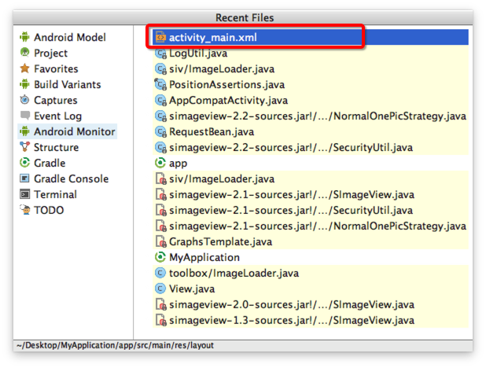

那么如果要查看之前修改过的文件, `Command + Shift + E`即可.  可以配合`Control + Tab`进行快速界面的切换. 

**快捷键**

* 最近操作
    * `Command + E` **(mac)**
    * `ctrl + E` **(win)**
* 最近修改
    * `Command + Shift + E`  **(mac)**
    * `ctrl + shift + enter` **(win)**

<a name="4"/>
### 文件查找

`search Everywhere`

项目中的全局查找功能文件功能

**查找类文件**

* `command + o` **(mac)**
* `ctrl + n` **(win)**

默认只是在项目代码中查找类文件, 如果需要查找`sdk`或者类库中的相关类. 再按一次快捷键, 或者勾选下图选项搜索全局类文件

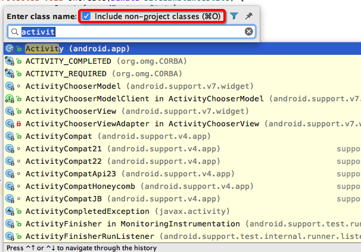

---

**查找文件**

这个级别比上面那个更广. 包括所有文件, 如`xml`等. 

* `command + shift + o` **(mac)**
* `ctrl + shift + n` **(win)**

如上如果需要搜索类库或者源码, 请在按一次快捷键, 或者勾选`查找类`给出图中的选项. 

<a name="5"/>
### 操作记录

在浏览代码结构的时候, 很多时候总是会跟进许多类里面, 如果想回到之前浏览调转点. 那么这个快捷键你就必须要记住. 

* `Command + Option + Left\Right` 或者 `command + [`, `command + ]` **(mac)**
* `ctrl + alt + Left\Right`**(win)**

<a name="6"/>
### 移动行

这个不用太多介绍, 就是**整行**的上下移动. 

* `Option + shift + 方向键上\方向键下` **(mac)**
* `alt + shift + 方向键上\方向键下` **(win)**

<a name="7"/>
### 查找方法调用处

场景: 查找一个方法在何处被调用, 或者一个ID在哪里被引用. 选中这个方法**右键**, 选择`Find Usages`即可. 

快捷键:

* `option + F7` **(mac)**
* `alt + F7` **(win)**

<a name="8"/>
### 方法的跟进

方法总是伴随着调转, 我们也总是会对方法的内部查看细节. 常用的办法是`按住Command 并点击方法名`的方式. 

也可以在光标所在处直接通过`Command + B`进行方法内部跟进. 

* `Command + B` **(mac)**
* `ctrl + alt + B` **(win)**

<a name="9"/>
### 显示方法的参数

当我们使用一个方法的时候, 会在刚开始的时候显示出所有的参数. 但是过一会可能就不存在了. 这个时候如果你想知道下一个参数是什么类型, 或者看一下所有参数. 

快捷键:

* `command + P` **(mac)**
* `ctrl + P` **(win)**

如果你还想查看一下方法的文档, 不用跟进源码, 直接`F1`键即可显示出文档. 

<a name="10"/>
### 行的快速操作

快速删除行, 其实使用剪切功能就可以`Command + X`

**快速复制行**, 使用`command + D`**mac**, `ctrl + D`**win**

<a name="11"/>
### 多行操作

可能有时候我们会声明做一系列相关的变量为`float`类型, 但是真实的需要的是`int`类型. 这个时候就可以进行`多重选择`进行整体修改. 如下图:

按住`option`(win为`alt`)键, 然后鼠标进行区域的选择. 然后进行对应修改即可. 

你可能认为上面的必须要连续的才可以. 那么如果可以设置`多个光标点`是否就可以满足你的问题了?

看下图: 

* `option + shift + 鼠标点击` **(mac)**
* `alt + shift + 鼠标点击`**(win)**

即可添加一个`编辑光标`. 最后如果不需要那么就`esc`即可关闭多余光标. 

<a name="12"/>
### 快速补全完成

创建一个对象. 或者`findViewById()`有时总需要移动鼠标或者光标到末尾进行`分号`的补全. 这些都可以快捷键搞定.  当你用习惯之后, 会非常的方便好用. 

* `option + shift + enter`**(mac)**
* `ctrl + shift + enter`**(win)**

实现的功能 

* 方法体大括号的添加
* 行尾分号的添加
* 自动格式化改行操作等

<a name="13"/>
### 代码提示

任何地方都可以调出的代码提示. 

`control + option + /`(不是默认, mac默认为`control + space`). 这里要说的是. 代码提示之后一般都会`回车键`确定. 当按`回车键`的时候. 会保留光标之后的内容. 当有的时候我们并不需要. 这个时候你就可以使用`table`键进行选择. 它会将后面的输入内容删掉. 

win的快捷方式`ctrl + 空格`(win同样大部分和输入法冲突, 请手动在AS设置里面`keymap`项查找` completion basic`手动修改快捷键)

**快速生成变量**

比如在方法体中`logi`直接快速生成一个`log`日志输出的模板, 但是`TAG`这个常量还没有声明. 这个时候用光标移动到`TAG`上. 使用快捷键提示即可快速生成. 

* `option + enter`**(mac)**
* `alt + enter`**(win)**

<a name="14"/>
### 变量的快速操作

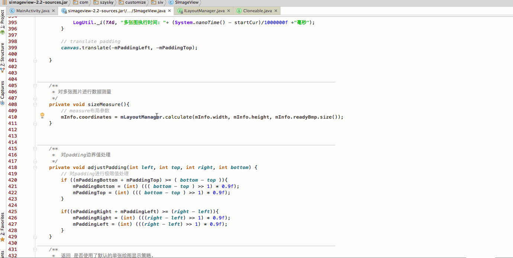

上图使用了两次快捷键, 

* 第一次: 跳转到变量的`声明处`
    * `command + B` **(mac)**
    * `ctrl + b`  **(win)**
* 第二次: 跳转到变量类型的`定义处`
    * `command + shift + B` **(mac)**
    * `ctrl + shift + b` **(win)**

<a name="15"/>
### 代码折叠

对代码块进行折叠和展开.

* `command + 加号\减号`**(mac)**
* `ctrl + 加号\减号` **(win)**

<a name="16"/>
### 预览方法定义

如果只想大体了解方法的定义, 而不需要进行方法所在源码类的跳转显示. 可以通过`Command + Y` (win快捷键为`ctrl + shift + I`)来进行预览

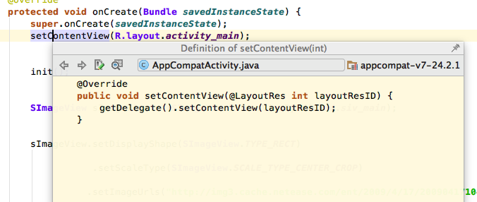

<a name="17"/>
### 粘贴板管理

对于复制粘贴. 我们习惯只是`单次`的`c+v`, 那么如果你想查看之前被覆盖了的`复制过的`内容. `AS`同样有`复制粘贴板`来管理.  展示最近几次的复制内容. 

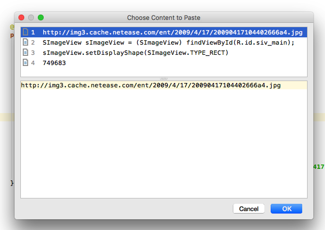

* `command + shift + v` **(mac)**
* `ctrl + shift + v`    **(win)**

<a name="18"/>
### 拆分窗口

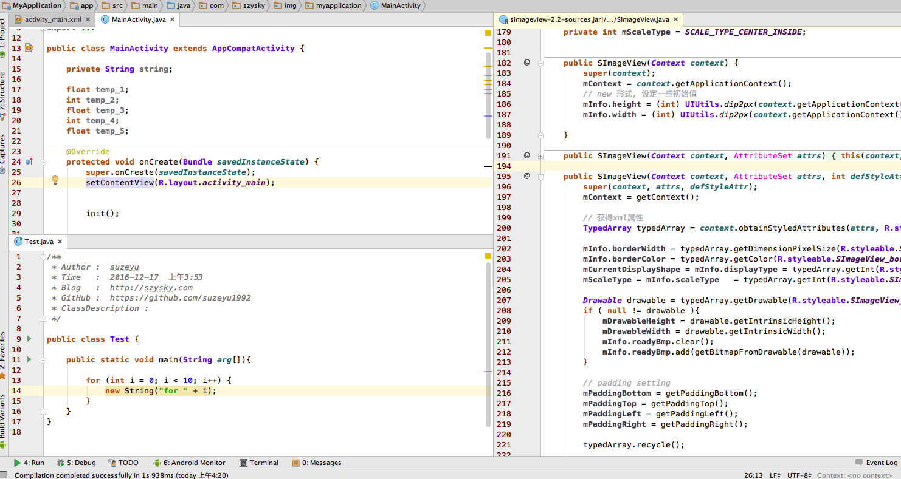

只需要在标签页上`右键`. 选择`split vertical\horizontal`. 

<a name="19"/>
### 变量命名风格

对于`成员变量`应该`m`开头. 对于`静态成员`通常是`s`开头.  可以这样设置这个风格. 

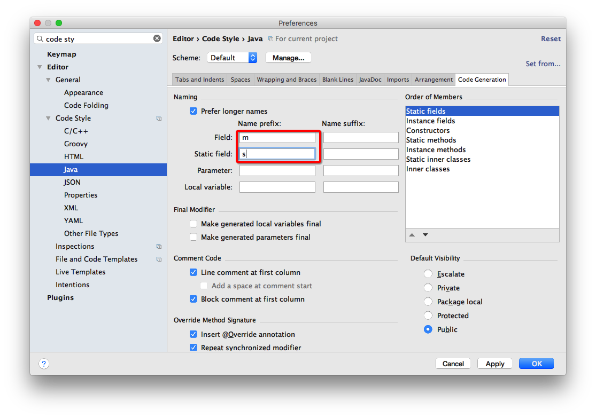

这样在输入一个变量的名字时, 就可以自动补全`m`或者`s`. 同时在`Extra`代码的时候, 生成的代码都可以自动根据这个规则重构. 

<a name="20"/>
### 查看大纲

当一个类很大的时候. 可以通过`command + F12`(win为`ctrl + F12`) 打开大纲界面. 展示全部的方法和成员变量列表. 

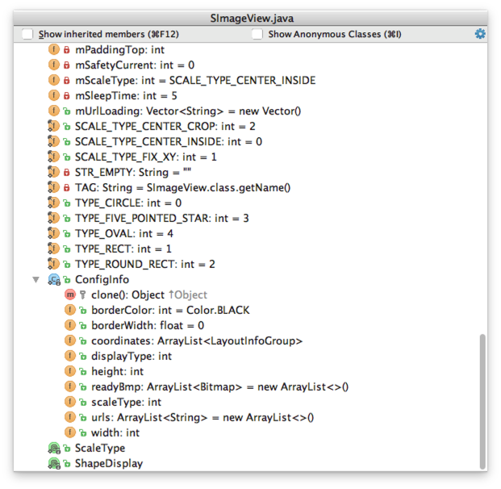

并且支持模糊搜索. 来进行筛选显示. 可以快速的找到要搜索的方法集.

<a name="21"/>
### 书签

在浏览大型代码, 或者调试时.  有时可能会需要记住一些关键的代码或者方法. 这个时候就可以使用`书签`. 来记录此关键代码. 只需要在点击需要标记的行, 并按`F3`就会在左侧出现一个`小对勾`. 这就说明已经打上了一个书签. 

同时在`Favorites`标签中, 也可以找到对应的`Bookmarks`

可以通过快捷键`command + F3` (win为`shift + F11`)快速调出书签面板, 进行后续的操作. 

<a name="22"/>
## 快速重构

<a name="23"/>
### 重构入口

当一个代码片段准备重构的时候. 可以使用`control + T` (win为`ctrl + alt + shift + T`)打开重构入口. 或者`右键单击`选择`Refactor`显示重构界面. 

这里有很多方便的功能. 提成方法等等. 

<a name="24"/>
### surround With

当对一个段代码进行, 条件包裹, 捕捉异常, 循环, Runnable等. 可以直接使用快捷的方式, 而不需要手动生成条件在进行代码块的`复制-粘贴`

快捷键

* `command + option + T`**(mac)**
* `ctrl + alt + T`**(win)**

<a name="25"/>
### Extract

你可以经常使用它,提取出一个方法. 

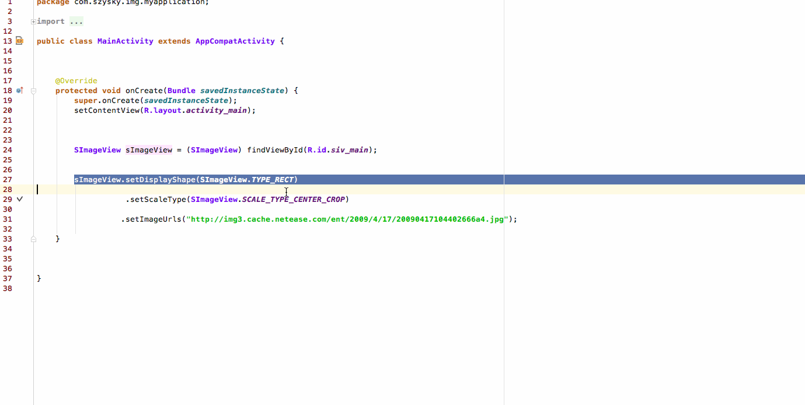

不仅仅如此, 你还可以对`xml`中的多个控件相同的属性进行抽取为`style`

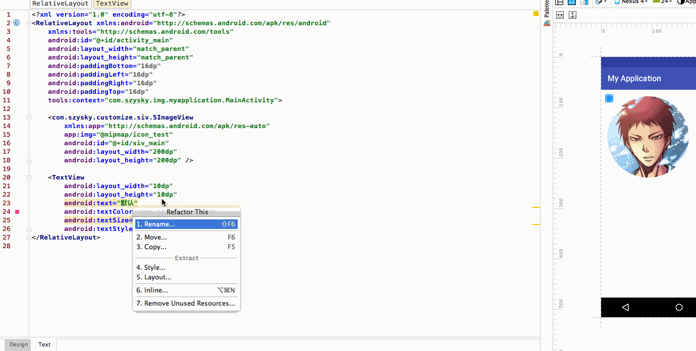

是不是很爽? 

这是其一, 对于`xml`不仅可以抽取`Style`, 还可以抽取布局`Layout`

而代码中, 可以提取各种变量, 参数, 长廊. 

<a name="26"/>
## 代码模板

`AS`中已经内置了很多代码模板, 你可以很嗖嗖嗖的就完成之前倒背如流的代码. 如下一小部分

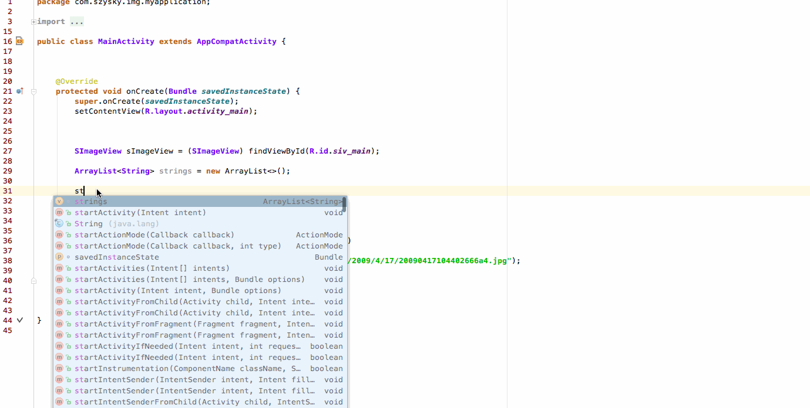

通过快捷键可调出这些代码模板

* `command + J`**(mac)**
* `ctrl + J`**(win)**

<a name="27"/>
## 代码分析

`Google`提供了很多代码分析工具, 这些工具都集中在顶部菜单栏的`Analyze`中. 

<a name="28"/>
### Inspect Code & Code cleanup

`Inspect Code`可以让`IDE`分析整个工程. 类似于`Lint`分析, 并会给出大致修改意见等

`Code cleanup`功能可以进行自动的代码修复. 

<a name="29"/>
### Dependencies

通过`Analyze`中的几个`Dependencies`选项. 可以快速分析项目的依赖. 

<a name="30"/>
### 方法调用栈

对于某些方法来说, 查看它被调用的地方和调用的顺序是非常重要的. 可通过`control + option + H`快速查找方法调用栈. 

<a name="31"/>
## 断点调试

<a name="32"/>
### 快速断点

`条件断点`. 主要用在循环体内. 一个循环10次的`for`. 只想在第`8`次进入断点. 

和`普通断点`相似, 一样先声明一个断点. 然后在`普通断点`上`单击鼠标右键`. 在弹出的菜单填写断点条件即可. 如下:

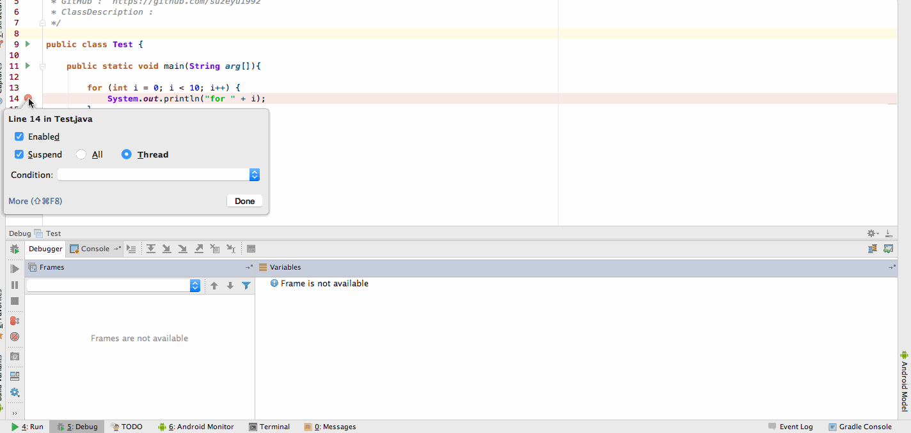

上面图中`Enable`可以控制`启用`, 还是`停用`一个断点. 

---

`临时断点`. 如果需要一个只执行一次的断点. 执行完之后断点自动取消. 那么可以通过快捷点将当前行作为临时断点. 

* `command + option + shift + F8`
* `ctrl + alt + shift + F8`

为了篇幅不是很长, 调试的部分贴一个讲解很详细的帖子

* [Android Studio代码调试大全](http://blog.csdn.net/dd864140130/article/details/51560664)

<a name="33"/>
## 快捷键查找表

速查表列出了`keymap`快捷键的名称. 可以直接通过`AS setting`界面搜索`keymap`. 通过对应的快捷键名称来添加或者修改快捷键. 

| 功能描述 | keymap对应名字 | Mac | Win/Linux |
| --- | --- | --- | --- |
| **提示错误解决方案** | **Show Intention Actions** | `option + enter` | `alt + enter` |
| **AS配置界面** | **Preferences** | `command + ,` | `control+alt+S` |
| **工程项目配置界面** | **Project Structure** | `command + ;` | `Control＋Alt+Shift+S` |
| **快速构成代码** | **Code Generate** | `command + N` | `alt + insert` |
| **代码提示** | **Completion/Basic** | `control + space`(mac会冲突, 手动修改) | `ctrl + 空格`(win同样大部分和输入法冲突, 手动修改) |
| **选择视图** | **select in any view** | `option + F1` | `alt + F1` |
| **添加书签标识** | **Toggle Bookmark** | `option + F3` | `ctrl + F11` |
| **向下移动一行** | **Move Line Down** | `option + shift + Down` | `alt + shift + Down` |
| **向上移动一行** | **Move Line Up**  | `option + shift + Up` | `alt + shift + Up` |
| **注释代码** | **Comment with Line Comment** | `command + /` | `ctrl + /` |
| **用代码模板包裹代码** | **surround with Live Template** | `command + option + J` | `ctrl + alt + J` |
| **格式化代码** | **Reformat Code** | `command + option + L` | `ctrl + alt + L` |
| **Copy Reference** | **Copy Reference** | `command + option + shift + C` | `ctrl + alt + shift + C` |
| **if/try等包裹代码** | **Surround With..** | `command + option + T` | `ctrl + alt + T` |
| **查看声明** | **Declaration** | `command + B` | `ctrl + B` |
| **快捷向下复制行** | **Duplicate Line or Block** | `command + D` | `ctrl + D` |
| **删除行** | **Delete Line** | `command + delete` | `ctrl + Y` |
| **快捷最近打开** | **Recent Files** | `command + E` | `ctrl + E` |
| **查找** | **Edit/Find/Find** | `command + F` | `ctrl + F` |
| **文件方法结构** | **File Structure** | `command + F12` | `ctrl + F12` |
| **显示书签** | **Show Bookmarks** | `command + F3` | `shift + F11` |
| **代码高亮向下查找** | **Move To Next Occurrence** | `command + G` | `F3` |
| **代码高亮向上查找** | **Move To Previous Occurrence** | `command + shift + G` | `shift + F3` |
| **按照模板生成代码** | **Insert Live Template** | `command + J` | `ctrl + J` |
| **定位到行** | **Navigate/Line** | `command + L` | `ctrl + G` |
| **快速到行首/尾** | **Move Caret to Line Start/End** | `command + Left/Right` | `ctrl + Left/Right` |
| **代码折叠/展开** | **Collapse/Expand** | `command + 减号/加号` | `ctrl + 减号/加号` |
| **查找类** | **Navigate/Class** | `command + O` | `ctrl + N` |
| **多行注释** | **Code/Comment ** | `command + option + /` | `ctrl + alt + /` |
| **格式化代码** | **Reformat Code** | `command + option + L` | `ctrl + alt + L` |
| **提示参数类型** | **Parameter Info** | `command + P` | `ctrl + P` |
| **查找替换** | **Replace** | `command + R` | `ctrl + R` |
| **查找命令** | **Find Action** | `command + shift + A` | `ctrl + shift + A` |
| **拷贝文件路径** | **Copy Paths** | `command + shift + C` | `ctrl + shift + C` |
| **移动代码块** | **Move Statement Up/Down** | `command + shift + down/up` | `ctrl + shift + down/up` |
| **代码补全** | **Complete Current Statement** | `command + shift + enter` | `ctrl + shift + enter` |
| **全路径查找** | **Find in Path** | `command + shift + F` | `ctrl + shift + F` |
| **代码高亮** | **Highlight Usages in File** | `command + shift + F7` | `alt + J` |
| **窗口内所有代码折叠/展开** | **Collapse/Expand All** | `command + shift + 减号/加号` | `ctrl + shift + 减号/加号` |
| **查找文件** | **Navigate/File** | `command + shift + O` | `ctrl + shift + N` |
| **全路径中替换** | **Replace in Path** | `command + shift + R` | `ctrl + shift + R` |
| **大小写转换** | **Toggle Case** | `command + shift + U` | `ctrl + shift + U` |
| **显示粘贴版历史** | **Paste from History** | `command + shift + V` | `ctrl + shift + V` |
| **快速查找定义** |  | `command + space` | `ctrl + shift + I` |
| **粘贴** | **Paste** | `command + V` | `ctrl + V` |
| **复制** | **Copy** | `command + C` | `ctrl + C` |
| **去除无效包引用** | **Optimize Imports** | `control + option + O` | `ctrl + alt + O` |
| **显示类关系继承体系** | **Type Hierarchy** | `control + H` | `ctrl + H` |
| **快速覆写方法** | **override Methods** | `control + O` | `ctrl + O` |
| **查找调用的位置** | **Call hierarchy** | `control + option + H` | `ctrl + alt + H` |
| **添加书签** | **Toggle Bookmark** | `F3` | `F11` |
| **扩大缩小选中范围** | **Extend Selection/Shrink Selection** | `option + UP/Down` | `ctrl + W + shift + W` |
| **跳转到父类** | **Super method** | `command + U` | `ctrl + U` |
| **关闭当前tab标签** | **Editor Tabs / Close** | `command + W` | `ctrl + shift + a` |
| **关闭除编辑窗口的其余窗口** | **Hide All Tool Windows** | `command + shift + F12` | `ctrl + shift + F12` |
| **预览方法定义** | **Quick Definition** | `command + Y` | `ctrl + shift + I` |
| **返回光标最后编辑位置** | **Last Edit Location** | `command + shift + delete` | `control + shift + Backspace` |
| **调到代码块首部/尾部** | **Move Caret To Code Block** | `Option + Command + [ 或者 ]` | `Control+[ 或者 ]` |
| **重命名** | **Rename** | `shift + F6` | `shift + F6` |
| **抽取方法** | **Extract Method** | `command + option + M` | `control+alt+M` |
| **抽取变量** | **Extract Variable** | `command + option + V` | `control+alt+V` |
| **抽取字段** | **Extract Field** | `command + option + F` | `control+alt+F` |
| **抽取常量** | **Extract Constant** | `command + option + C` | `control+alt+C` |
| **抽取参数** | **Extract Parameter** | `command + option + P` | `control+alt+P` |
| **重构入口** | **Refactor This** | `control + T` | `ctrl + alt + shift + T` |

* [作者GitHub](https://github.com/suzeyu1992/repo.git)

