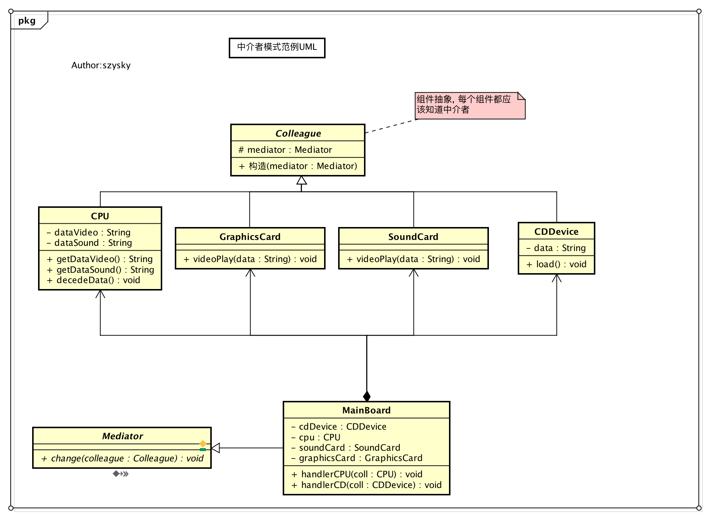
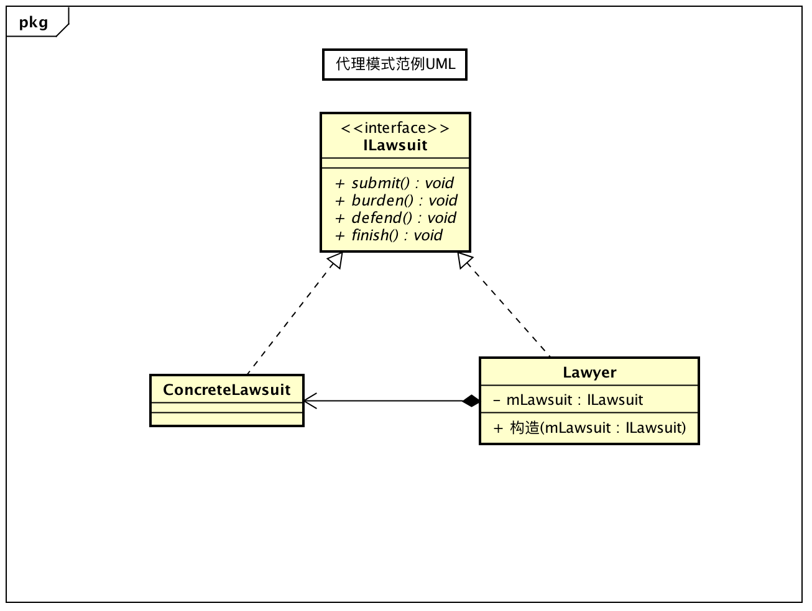
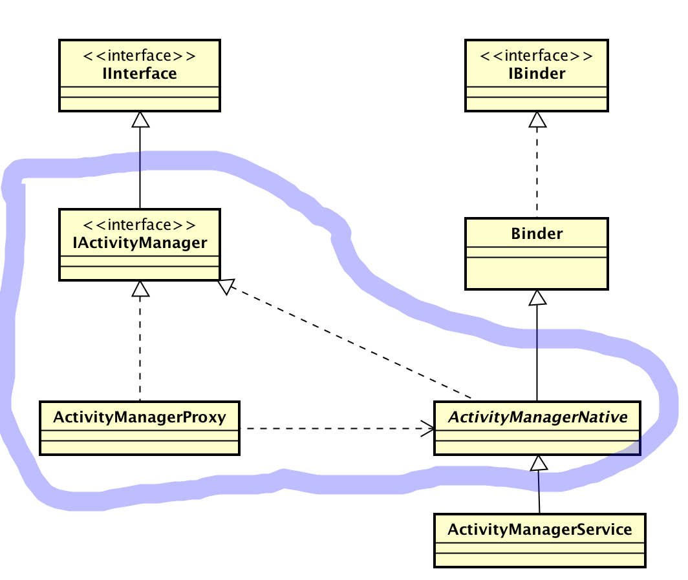
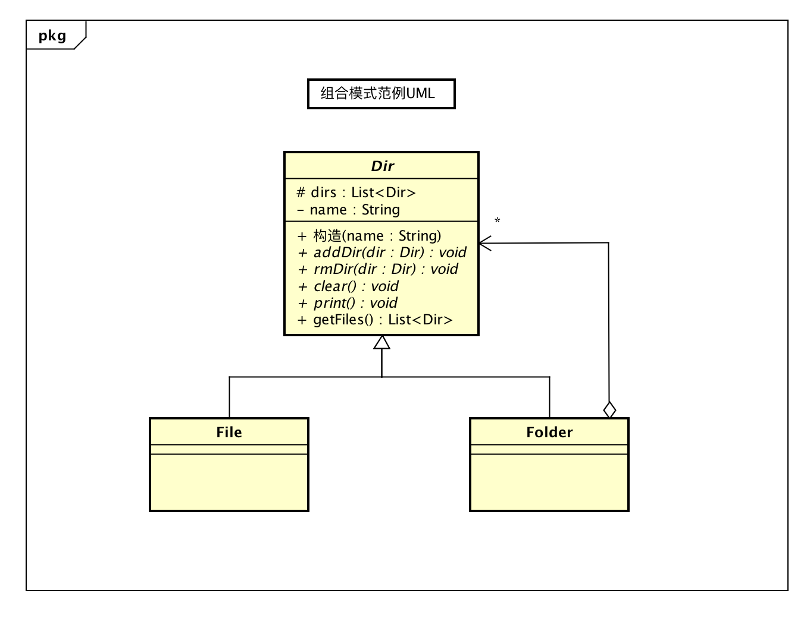
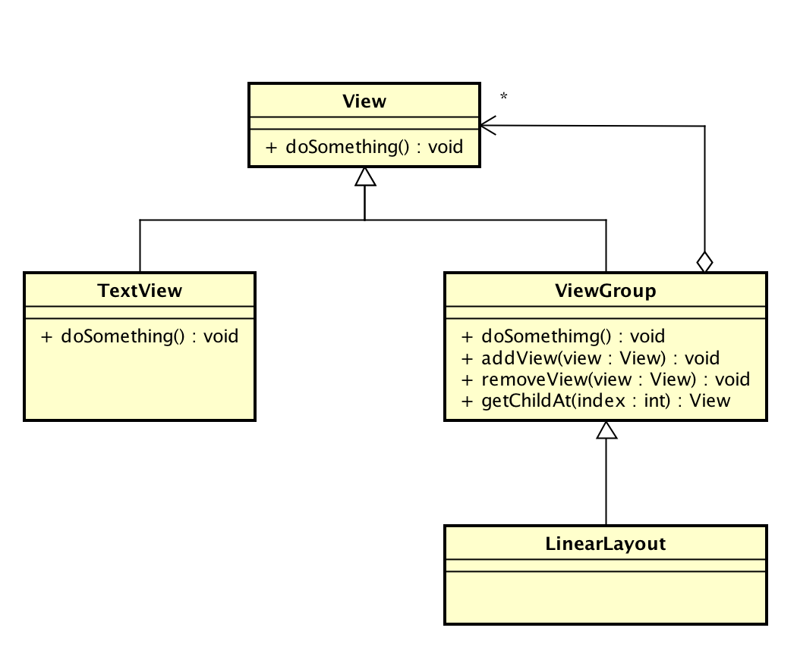
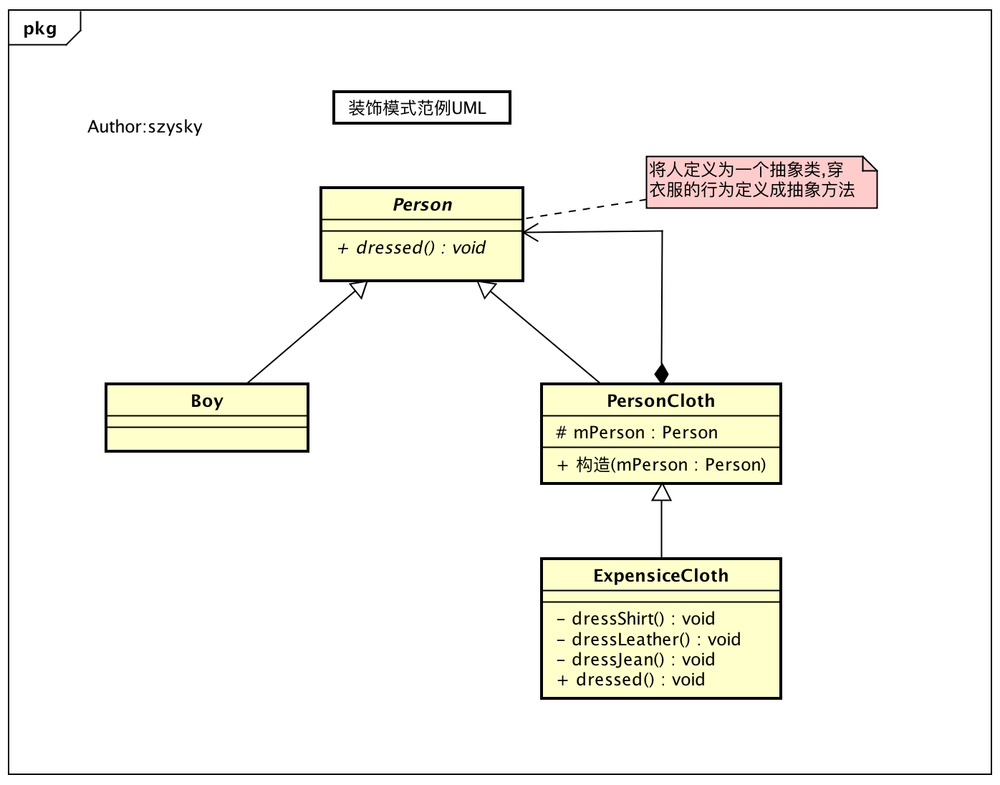
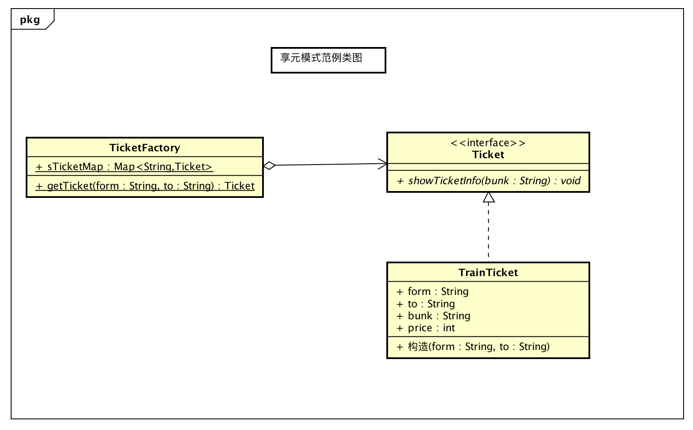
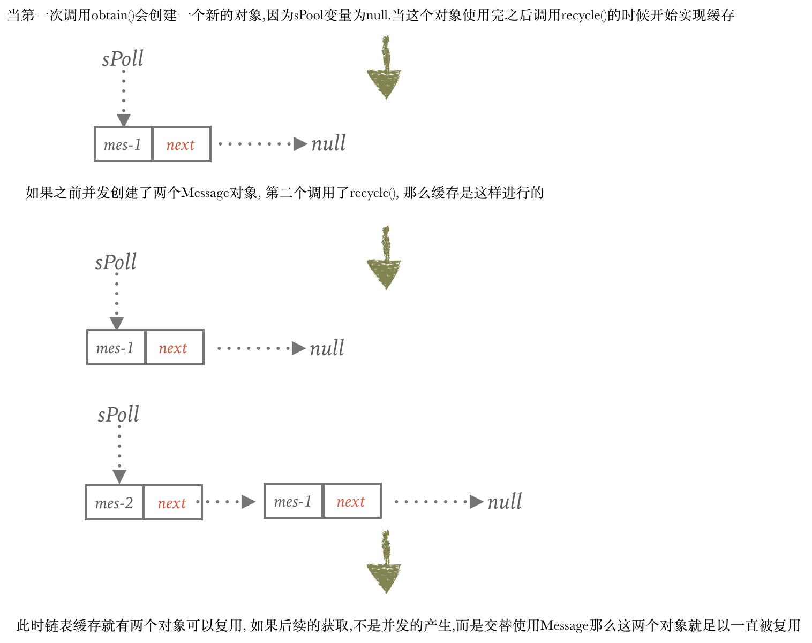
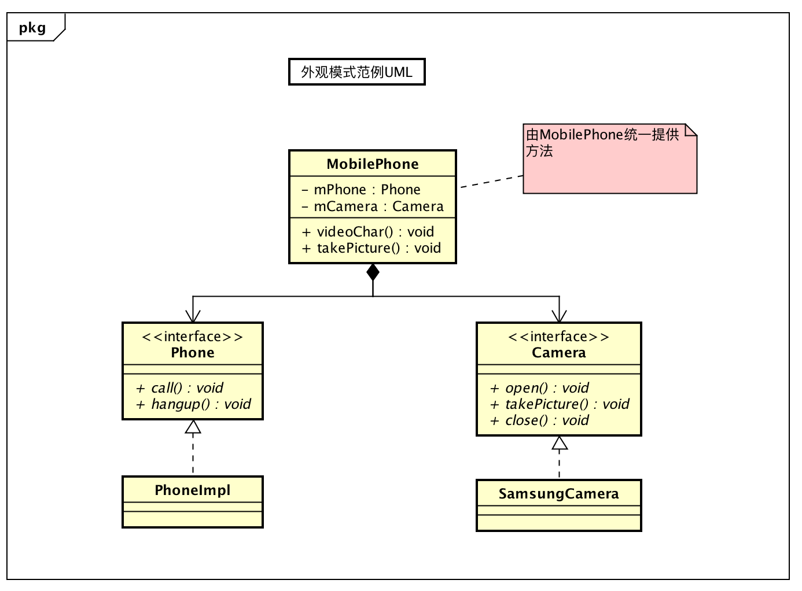

> 对于设计模式这是牛人们对代码中的一定场景而进行提炼的结果, 对于一个进阶的开发人员这是一个必不可少的技能. 当代码越写越好, 更易扩展更加灵活. 这对于Coder来说是最酷的事情.

> 通过`设计模式`和`Android源码`中的关系, 可以更加清楚的记住各个模式的特点, 和源码中的实现方式. **多练多分析之间的关系**这是必不可少的一步!

文章只是对`设计模式`做一个场景比对, 实现. 和简单说明. 最好可以自己动手代码实现, 分析代码之间的关系, 才能真正的学以致用. 


* [中介者模式 Mediator](#1)
   * [模式介绍](#2)
   * [模式范例](#3)
   * [Android源码模式实现](#4)
* [代理模式 Proxy](#5)
   * [模式介绍](#6)
   * [模式范例](#7)
   * [Android源码模式实现](#8)
* [组合模式 Composite](#9)
   * [模式介绍](#10)
   * [模式范例](#11)
   * [Android源码模式实现](#12)
* [适配器模式 Adapter](#13)
   * [模式介绍](#14)
   * [模式范例](#15)
   * [Android源码模式实现](#16)
* [装饰模式 Decorator](#17)
   * [模式介绍](#18)
   * [模式范例](#19)
   * [Android源码模式实现](#20)
* [享元模式 Flyweight](#21)
   * [模式介绍](#22)
   * [模式范例](#23)
   * [Android源码模式实现](#24)
* [外观模式 Facade](#25)
   * [模式介绍](#26)
   * [模式范例](#27)
   * [Android源码模式实现](#28)
* [桥接模式](#29)
   * [模式介绍](#30)
   * [模式范例](#31)
   * [Android源码模式实现](#32)


    
  <a name="1"/>  
### 中介者模式 Mediator 

  <a name="2"/>  
#### 模式介绍

> 也称为调节者模式或者调停者模式

* `定义`: 包装了一系列对象互相作用的方式, 使得这些对象不必互相明显作用. 从而使他们可以松散耦合. 当某些对象之间的作用发生改变时, 不会立即影响其他的一些对象之间的作用. 保证这些作用可以彼此独立的变化. 中介者模式将多对多的关系转化为一对多的相互作用. 中介者模式将对象的行为和协作抽象化, 把对象在小尺度的行为上与其他对象的相互作用分开处理.
* `场景`: 当对象之间的交互操作很多且每个对象的行为都依赖彼此时, 为防止在修改一个对象的行为会涉及修改很多其他对象的行为, 可采用中介者模式, 来解决紧耦合问题. 该模式将对象之间的多对多关系变成了一对多关系, 中介者对象将系统从网状结构变成以调停者为中心的星形结构, 达到降低系统的复杂性, 提高可扩展的作用.

<a name="3"/>
#### 模式范例

场景: 以电脑为例, 电脑主要部分为:CPU, 内存, 显卡, IO设备. 通常需要一个东西把这些组件连接起来共同工作,这就是主板的工作. 任何的两块模块之间的通信都会经过主板去协调. 这里以读取光盘为例.看主板是如何充当这个中介者角色的.

[范例代码](https://github.com/suzeyu1992/AlgorithmTraining/tree/master/src/design/mediator)



代码使用


```java
public static void main(String arg[]){

   // 构造主板对象
   MainBoard mainBoard = new MainBoard();

   // 构造各个零件同事
   CDDevice cdDevice = new CDDevice(mainBoard);
   CPU cpu = new CPU(mainBoard);
   GraphicsCard graphicsCard = new GraphicsCard(mainBoard);
   SoundCard soundCard = new SoundCard(mainBoard);

   // 将各个部件安装到主板
   mainBoard.setCdDevice(cdDevice);
   mainBoard.setCpu(cpu);
   mainBoard.setGraphicsCard(graphicsCard);
   mainBoard.setSoundCard(soundCard);

   // 完成后开始放片
   cdDevice.load();
}
```


从图片可以看出, 虽然彼此间会互相交互, 但是通过中介者模式, 会让一个网状的关系, 转成一个以`中介者`为中心的星状图.

<a name="4"/>
#### Android源码对应实现

中介者模式在`Android`源码中比较好的例子是`Keyguard`锁屏的实现. 


```java
public class KeyguardViewMediator extends SystemUI {
    private AlarmManager mAlarmManager;
    private AudioManager mAudioManager;
    private StatusBarManager mStatusBarManager;
    private boolean mSwitchingUser;

    private boolean mSystemReady;
    private boolean mBootCompleted;
    private boolean mBootSendUserPresent;
    // ....
}
```

可以看到类中存在很多`XXManager`的变量, 这些各种各样的管理器就是各个具体的实现类, `Android`使用`KeyguardViewMediator`充当这个中介者协调这些管理器的状态改变, 同样也会定义很多方法来处理这些管理器的状态, 以解锁或锁屏时声音的播放为例, 对应的方法`playSounds()`来协调音频这一状态.

而其他管理器的协调同样可以在此类找到.

---

而另一个中介者模式的例子就是`Binder`机制, 在`Binder`机制中有3个非常重要的组件`ServiceManager`,`Binder Driver`和`Bp Binder`. 其中`Bp Binder`是`Binder`的一个代理角色, 其提供了`IBinder`接口给各个客户端服务使用, 这三者就扮演了一个中介者角色

当手机启动后, `ServiceManager`会先向`Binder Driver`进行注册, 同样`ServiceManager`也是一个服务, 但特殊性在于, 它在`Binder Driver`中是最先被注册的, 其注册`ID`为0, 当其他的服务想要注册到`Binder Driver`时, 会先通过这个`0号ID获取到ServiceManager`所对应的`IBinder`接口, 该接口实质上的实现逻辑是由`Bp Binder`实现的, 获取到对应的接口后就回调其中的`transact()`方法, 此后就会在`Binder Driver`中注册一个`ID 1`来对应这个服务, 如果客户端想要使用这个服务, 那么他会先获取`ID 0`的接口, 也就是`ServiceManager`所对应的接口, 并调用其`transact()`要求连接到刚才的服务, 这个时候`Binder Driver`就会将`ID 1`的服务回传给客户端并将相关信息反馈给`ServiceManager`完成连接. 这里`ServiceManger`和`Binder Driver`就相当于一个中介者, 协调各个服务器和客户端. 


<a name="5"/>
### 代理模式 Proxy

<a name="6"/>
#### 模式介绍

> 也称委托模式, 结构性设计模式. 生活中也是有很多常见的代理例子, 代理上网, 叫外卖, 通过律师打官司都是一种代理

* `定义`: 为其他对象提供一种代理以控制对这个对象的访问
* `场景`: 当无法或不想直接访问某个对象或访问某个对象存在困难时可以通过一个代理对象来间接访问, 为了保证客户端使用的透明性, 委托对象与代理对象需要实现相同的接口. 


<a name="7"/>
#### 模式范例

场景: 公司拖欠工资, 员工通过律师来间接的和公司要钱.

[范例源码](https://github.com/suzeyu1992/AlgorithmTraining/tree/master/src/design/proxy)



使用时代码


```java
public static void main(String args[]){
   // 构造一个起诉者
   ConcreteLawsuit concreteLawsuit = new ConcreteLawsuit();

   // 构造一个律师, 被代理者
   Lawyer lawyer = new Lawyer(concreteLawsuit);

   // 律师代理
   lawyer.submit();
   lawyer.burden();
   lawyer.defend();
   lawyer.finish();
}
```

代理模式大致分为两个部分, 一个是`静态代理`,还有一个是`动态代理`. 

* `静态代理`如上述示例那样, 代理者的代码由程序员自己或者通过自动化工具生成固定的代码再对其进行编译, 也就是说在我们的代码运行前`代理类class`编译文件就已经存在
* `动态代理`则与静态代理相反, 通过反射机制动态生成代理者对象, 也就是说我们在`code阶段`压根就不需要知道代理谁, 代理谁将会在执行阶段决定, 而`Java`也给我们提供了一个便捷的动态代理接口`InvocationHandler`, 并复写`invoke()`

动态代理最终的调用方式:


```java
// 构造一个动态代理
DynamicProxy dynamicProxy = new DynamicProxy(concreteLawsuit);

// 获取被代理者的ClassLoader
ClassLoader classLoader = concreteLawsuit.getClass().getClassLoader();

// 动态构造一个代理者律师
ILawsuit law = (ILawsuit) Proxy.newProxyInstance(classLoader, new Class[]{ILawsuit.class}, dynamicProxy);

// 动态调用
law.submit();
law.burden();
law.defend();
law.finish();
```

<a name="8"/>
#### Android源码对应实现

`Android`源码中的代理模式实现有很多, 如源码中的`ActivityManagerProxy`代理类, 其具体代理的是`ActivityManagerNative`的子类`ActivityManagerService`. `ActivityManagerProxy`与`ActivityManagerNative`处于同一个文件. 

而`ActivityManagerProxy`和`ActivityManagerNative`都继承了`IActivityManager`



可以很明显的看出这三个类构成的`代理模式`, 但是由于`AMN`是抽象类, 所以具体的实现交由了子类`AMS`去实现. 而`AMS`是系统级的`Service`并且运行于独立的进程空间中, 可以通过`ServiceManager`来获取它. 而`AMP`也运行于自己所处的进程空间中, 两者并不相同, 因此`AMS`和`AMP`的通信必定是通过跨进程来进行的, 所以此处源码中所实现的实质为远程代理. 

`AMP`在实际的逻辑处理中并未过多地被外部类使用, 因为在`Android`中管理与维护`Activity`相关信息的是另一个叫做`ActivityManager`的类, `ActivityManager`虽说管理着相关信息, 但是实质上其大多数逻辑都是由`AMP`承担的. 

<a name="9"/>
### 组合模式 Composite


<a name="10"/>
#### 模式介绍

> 结构性设计模式, 比较简单, 把一组相似的对象看做一个对象来处理, 并根据一个树状结构来组合对象, 然后提供一个统一的方法去访问相应的对象, 以此忽略掉对象与对象集合之间的差别. 

* `定义`: 将对象组合成树形结构以表示`整体-部分`的层次结构, 使得用户对单个对象和组合对象的使用一致性
* `场景`:
    * 表示对象的部分-整体层次结构
    * 从一个整体中能够独立出部分模块或功能的场景
 
 <a name="11"/>   
#### 模式范例

一个很好的组合例子就是文件夹和文件之间的关系. 以此为例, 看看一个简单文件系统是如何构成的. 

[范例源码](https://github.com/suzeyu1992/AlgorithmTraining/tree/master/src/design/composite)



使用代码和结果


```java
public static void main(String arg[]){
   // 构造一个目录对象表示c盘目录
   Folder diskC = new Folder("C");

   // C盘根目录下有一个文件 Log.txt
   diskC.addDir(new File("Lag.txt"));

   // C盘下还有3个子目录
   diskC.addDir(new Folder("目录1"));

   Folder dirs = new Folder("目录2");
   dirs.addDir(new File("null.txt"));
   diskC.addDir(dirs);

   diskC.addDir(new Folder("目录3"));

   // 打印文件结构
   diskC.print();
}

// =========> 结果
C (Lag.txt,目录1 (),目录2 (null.txt),目录3 ())
```
从根节点依次延伸可以很明显看出这是一个树状的嵌套结构. 这就是组合模式


<a name="12"/>
#### Android源码对应实现

这个模式在`Android`有一个很经典的表示, 我们一直再使用, 就是`View`和`ViewGroup`结构.



由于`View`的视图层级中使用的是`安全的设计模式`, 所以只能是`ViewGroup`才可以包含`View`,反之则不可以, 而上面的范例使用的是`透明的组合模式`. 可以观察一下具体有哪些不同. 

<a name="13"/>
### 适配器模式 Adapter

<a name="14"/>
#### 模式介绍

> 这也是一个我们从始至终都在使用的模式, `ListView`,`GridView`,`RecycleView`. 适器就是将两个不兼容的类融合在一起, 有点像粘合剂.


* `定义`: 把一个类的接口转换成客户端所期待的另一个接口, 从而使原本因接口不匹配而无法在一起工作的两个类能够在一起工作. 
* `场景`: 
    * 系统需要使用现有的类, 而此类的接口不符合系统的需要, 即接口不兼容
    * 想要建立一个可以重复使用的类, 用于与一些比起之间没有太大关联的一些类, 包括一些可能在将来引进的类一起工作
    * 需要一个统一的输出接口, 而输入端的类型不可预知

<a name="15"/>
####  模式范例

软件开发有一句话: `任何问题都可以加一个中间层来解决`. 正式对适配器模式的描述, 最常见的就是笔记本电脑一般用的5V电压, 但是生活中的电压都是标准的220V.  所以我们笔记本都通过一个电源适配器来解决此问题. 

[范例代码](https://github.com/suzeyu1992/AlgorithmTraining/tree/master/src/design/adapter)


类图关系很简单就不贴出来了

代码中有两种实现:

* `类适配器模式` : 主要是`Adapter`角色是**继承需要适配**的角色.
* `对象适配器模式`: 通过在构造适配器的时候**传入适配对象**. 使用组合的形式实现接口兼容. 

相比较, 使用`对象适配器`更加的灵活, 另一个好处就是被适配对象的方法不会暴露出来, 而`类适配器`由于继承了被适配的对象, 因此被适配对象类在`Adapter`类中同样存在, 这就使得`Adapter`出现了一些奇怪的方法, 用户的使用成本也较高. 

<a name="16"/>
#### Android源码对应实现

不用说`Adapter`大家都知道. `Android`的做法增加了个`Adapter`层来隔离变化, 将`ListView`需要的关于`Item View`接口抽象到`Adapter`对象中, 并且在`ListView`内部调用了`Adapter`这些接口完成布局等操作. 这样只要用户实现了`Adapter`的接口, 并且将该`Adapter`设置给`ListView`, `ListView`就可以按照用户设定的`UI`效果, 数量, 数据来显示每一项数据. 


<a name="17"/>
### 装饰模式 Decorator

<a name="18"/>
#### 模式介绍

> 也称包装模式, 结构性设计模式, 使用一种对客户端透明的方式来动态的扩展对象的功能, 同时他也是继承关系的一种替代方案之一

* `定义`: 动态地给一个对象添加一些额外的职责. 就增加功能来说, 装饰模式相比生成子类更加灵活.
* `场景`: 需要透明且动态地扩展类的功能时

<a name="19"/>
#### 模式范例

人穿衣服的例子

[范例源码](https://github.com/suzeyu1992/AlgorithmTraining/tree/master/src/design/decorator)



其实可以这种扩展并非是直接修改原有方法逻辑或者结构, 更恰当的说, 仅仅是在另一个类中将原有方法和逻辑进行封装整合.

`装饰模式`和`代理模式`有点类似, 比较容易混淆的是会把装饰模式当成代理模式. `装饰模式`是以对客户端透明的方式扩展对象的功能, 是继承关系的一个替代方案. 而`代理模式`则是给一个对象提供一个对象代理, 并由代理对象来控制对原有对象的引用. `装饰模式`应该为所装饰的对象增强功能; `代理模式`对代理的对象施加控制, 但不对对象本身的功能增强. 


<a name="20"/>
#### Android源码对应实现

`Context`, 是不是熟悉的不能再熟悉了. 它的本质就是一个抽象类. 在装饰模式中相当于`抽象组件`. 虽然`Activity`继承了`Context`但是其中的`startActivity()`,`startService()`这些都是由另一个继承者来处理的的. 这个`Context`的另一个继承者就是`ContextImpl`. 

`ContextImpl`内部实现了`Context`的抽象方法. 而`Activity`等组件只是将其中的方法进行了转发调用.


<a name="21"/>
### 享元模式 Flyweight

<a name="22"/>
#### 模式介绍

> 用尽可能减少内存使用量, 它适合用于可能存在大量重复对象的场景, 来缓存可共享的对象, 达到对象共享, 避免创建过多对象的效果. 就可以提升性能, 避免内存抖动

* `定义`: 使用共享对象可有效地支持大量的相似对象
* `场景`: 
    * 系统中存在大量的相似对象
    * 细粒度的对象都具备比较接近的外部状态, 而且内部状态与环境无关, 也就是说对象没有特定身份
    * 需要缓冲池的场景
  
  <a name="23"/>  
#### 模式范例

通过售票口的出票来为例

[范例代码](https://github.com/suzeyu1992/AlgorithmTraining/tree/master/src/design/flyweight)

 

代码使用和结果


```java
public class Client {

    public static void main(String arg[]){
        Ticket ticket = TicketFactory.getTicket("青岛", "北京");
        ticket.showTicketInfo("上铺");

        Ticket ticket1 = TicketFactory.getTicket("青岛", "上海");
        ticket1.showTicketInfo("上铺");

        Ticket ticket2 = TicketFactory.getTicket("青岛", "北京");
        ticket2.showTicketInfo("上铺");
    }
}

// ========> 
创建对象--> 青岛-北京
购买 从青岛 到 上铺 的北京火车票, 价格: 293
创建对象--> 青岛-上海
购买 从青岛 到 上铺 的上海火车票, 价格: 20
使用缓存--> 青岛-北京
购买 从青岛 到 上铺 的北京火车票, 价格: 141
```

其实主要思想就是: 让可复用的对象实现复用, 减少无用的重复创建的步骤. 


<a name="24"/>
#### Android源码对应实现

`Message`对象. 在使用`Handler`传递数据的时候. 不可避免的需要使用`Message`. 即使你通过`Handler.post(Runnable)`传递一个接口, 在源码内部同样会通过`Message`为载体挂到`callback`变量上传递. 看一下. 源码中是如何维护一个频繁需要使用对象的


```java
private static Message sPool;  // 静态!

// 获取一个Message
public static Message obtain() {
   synchronized (sPoolSync) {
       if (sPool != null) {
           Message m = sPool;
           sPool = m.next;
           m.next = null;
           m.flags = 0; // clear in-use flag
           sPoolSize--;
           return m;
       }
   }
   return new Message();
}

// 回收, 实现缓存的方法
public void recycle() {
   if (isInUse()) {
       if (gCheckRecycle) {
           throw new IllegalStateException("This message cannot be recycled because it "
                   + "is still in use.");
       }
       return;
   }
   recycleUnchecked();
}

void recycleUnchecked() {
   flags = FLAG_IN_USE;
   what = 0;
   arg1 = 0;
   arg2 = 0;
   obj = null;
   replyTo = null;
   sendingUid = -1;
   when = 0;
   target = null;
   callback = null;
   data = null;

   synchronized (sPoolSync) {
       if (sPoolSize < MAX_POOL_SIZE) {
           next = sPool;
           sPool = this;
           sPoolSize++;
       }
   }
}
```


`Android`是在调用了`recycle()`方法的时候实现了缓存, 在`obtain()`的时候取缓存如果没有, 那么就会创建新的对象. 缓存实现的方式是一个`单向链表`, 每次调用`recycle()`会把这个对象挂在`链表头`.看一下如下的图. 




<a name="25"/>
### 外观模式 Facade

<a name="26"/>
#### 模式介绍

> 使用频率很高, 也可以说是第三方SDK都会使用, 本质就是加上一个中间层的传递, 既可以做到统一一个高层类, 降低用户的使用成本, 也能屏蔽一些实现细节. 可能你不经意间使用很多次此模式, 只是没有在理论层面认知它的存在.


* `定义`: 要求一个子系统的外部与其内部的通信必须通过一个统一的对象进行. 门面模式也就是`Facade模式`提供了一个高层次的接口. 
* `场景`: 
    * 为一个复杂子系统提供一个简单接口.
    * 当需要构建一个层次结构的子系统时. 使用外观模式定义子系统的每层的入口点. 如果子系统相互依赖可以仅通过`facade`进行通信.
    
    <a name="27"/>
#### 模式范例 

以手机的外观模式为例

[范例代码](https://github.com/suzeyu1992/AlgorithmTraining/tree/master/src/design/facade)




<a name="28"/>
#### Android源码对应实现

还是`Context`, `Context`对于开发者来说是最重要的高层接口. `Context`只是定义了很多接口的抽象类, 这些接口的功能实现并不是在`Context`以及子类中, 而是通过其他的子系统来完成的, 例如`startActivity()`的真正实现是通过`AMS`, 获取应用包信息是通过`PMS`. 而`Centext`只是做了一个高层次的统一封装.  

好处显而易见, 对于开发者, 你只要知道这个高层类即可.  不需要知道太多的子系统就能完成开发. 


<a name="29"/>
### 桥接模式

<a name="30"/>
#### 模式介绍

> 结构性设计模式

* `定义`: 将抽象部分与实际部分分离, 使他们都可以独立地进行变化
* `场景`: 
    * 一个类存在两个独立变化的维度, 且这两个维度都需要进行扩展
    * 对于那些不想使用继承或者因为多层次继承导致系统类的个数的急剧增加的系统, 也可以考虑使用此模式
    * 如果一个系统需要在构件的抽象化角色和具体化角色之间更加灵活, 避免在两个层次之间建立静态的继承联系, 可以通过桥接模式使他们在抽象层建立一个关联关系

<a name=31"/>    
#### 模式范例

以喝咖啡为例子, 一个咖啡馆中咖啡有四种, 分别是大杯加糖, 小杯加糖, 大杯无糖, 小杯无糖.  但是对于一杯咖啡来说这4种状态中实际上就是`两种变化`. 糖的状态和杯的状态.

[范例代码](https://github.com/suzeyu1992/AlgorithmTraining/tree/master/src/design/bridge)

代码使用以及结果:


```java
public static void main(String args[]){

   // 原汁原味
   Ordinary ordinary = new Ordinary();

   // 准备糖类
   Sugar sugar = new Sugar();

   // 大杯咖啡原味
   LargeCoffee largeCoffee = new LargeCoffee(ordinary);
   largeCoffee.makeCoffee();

   // 小杯咖啡 原味
   SmallCoffee smallCoffee = new SmallCoffee(ordinary);
   smallCoffee.makeCoffee();

   // 大杯咖啡 加糖
   LargeCoffee larSugar = new LargeCoffee(sugar);
   larSugar.makeCoffee();

   // 小杯咖啡 加糖
   LargeCoffee smallSugar = new LargeCoffee(sugar);
   smallSugar.makeCoffee();
}
//=========>结果
大杯的 原味 咖啡
小杯的 原味 咖啡
大杯的 加糖 咖啡
大杯的 加糖 咖啡

```

这里`CoffeeAdditives`相当于作为了`实现部分`, 而`Coffee`则对应抽象部分, 模式中定义所谓的`抽象`和`实现`实质上对应的是两个独立变化的维度. 也就是说**任何多维度变化或者说多个树状类之间的耦合都可以使用桥接模式来解耦**. 范例中的这两个基类, 并不一定就是所谓的对应的角色, 两者各自为一维度,独立变化.

 如果需要增加口味的种类, 只需要继承`CoffeeAdditives`实现不同的子类即可完成加奶,加盐的新功能的添加.  不管是这两个角色谁变化了, 相对于对方而言都是独立的没有过多的交际. 
 
 
 <a name="32"/>
#### Android源码对应实现
 
 `桥接模式`在`Android`中应用的比较广泛. 一般都是作用于大范围.
 
 * `View`的具体控件都定义了不同类型控件的所拥有的基本属性和行为, 但是将它们绘制到屏幕上的部分是与`View`相关的功能类`DisplayList`,`Hardwarelayer`,`Canvas`负责. 这俩个部分可以看做桥接
 * `Adapter`与`AdapterView`之间也可以看做是桥接
 * `Window`和`WindowManager`之间的关系. `Window`和`PhoneWindow`构成窗口的抽象部分; `WindowManager`和`WindowManagerImpl`为实现部分;  实现部分的具体实现类`WMI`使用`WindowManagerGlobal`通过`IWindowManager`接口与`WMS`进行交互. 并由`WMS`完成具体的窗口工作. 


